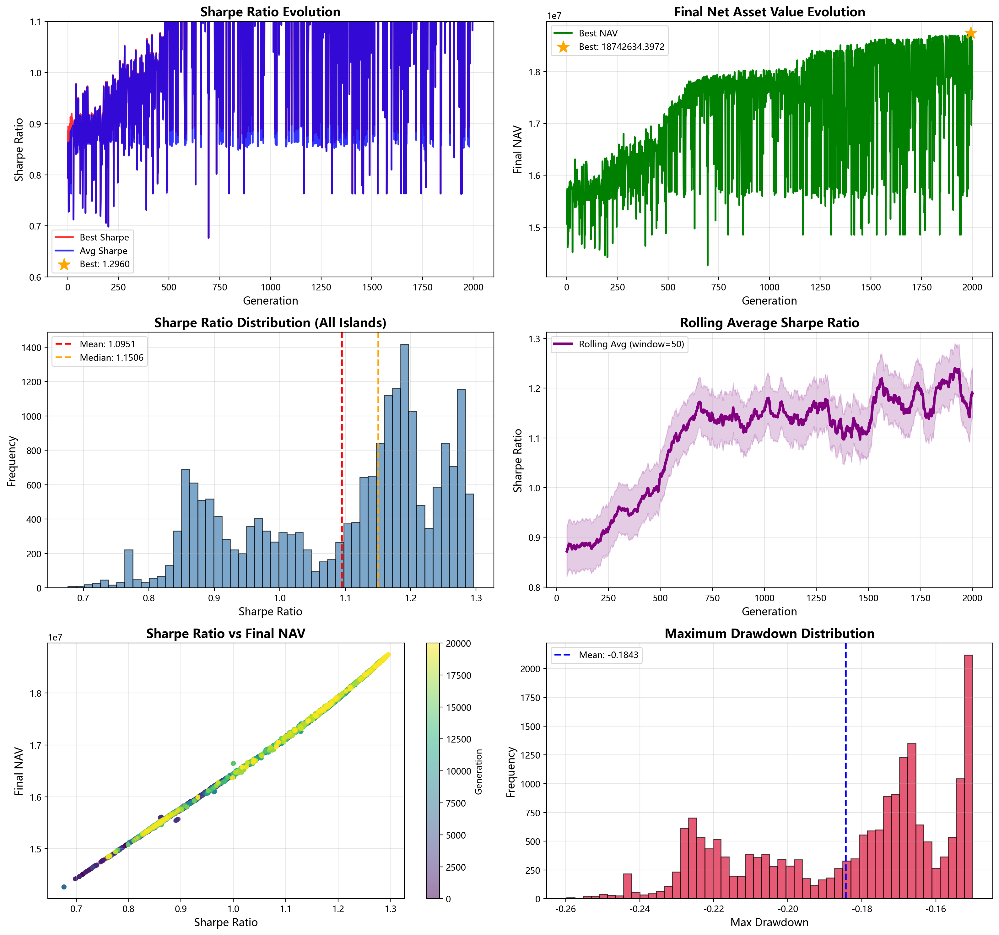

# FunSearch 进化分析报告

## 1. 概览

- **生成时间**: 2026-04-24 09:37:19
- **总进化代数**: 2001
- **每代Island数量**: 10
- **总评估次数**: 20010

## 2. 性能统计

### 2.1 整体表现

| 指标 | 值 |
|------|-----|
| **最佳夏普比率** | 1.295964 |
| **最佳夏普代数** | 第 1992 代 |
| **最佳最终净值** | 18742634.397214 |
| **最佳净值代数** | 第 1992 代 |
| **平均夏普比率** | 1.097891 |
| **夏普比率标准差** | 0.145643 |

### 2.2 分阶段统计

| 阶段 | 代数范围 | 平均夏普 | 最高夏普 | 最低夏普 | 标准差 |
|------|---------|---------|---------|---------|--------|
| 初期 | 0.8778 | 0.9783 | 0.7136 | 0.0543 |
| 中期 | 0.9472 | 1.1090 | 0.6989 | 0.0728 |
| 后期 | 1.1334 | 1.2166 | 0.6769 | 0.0977 |
| 末期 | 1.1624 | 1.2960 | 0.7631 | 0.1286 |

### 2.3 所有Island统计

| 指标 | 值 |
|------|-----|
| **总策略评估数** | 20010 |
| **平均夏普比率** | 1.095080 |
| **平均最终净值** | 17160113.865831 |
| **平均最大回撤** | -0.184301 |

## 3. 进化趋势分析

### 3.1 夏普比率趋势

- 从初期到末期，平均夏普比率变化: +32.42%
- 进化效果良好

- 最佳夏普比率出现在第 1992 代: 1.295964
- 最佳最终净值出现在第 1992 代: 18742634.397214

### 3.2 稳定性分析

- 夏普比率变异系数 (CV): 13.27%
- 进化过程波动较大

## 4. 可视化

### 4.1 进化过程总览


### 4.2 夏普比率进化趋势
- 红色线: 每代最佳夏普比率
- 蓝色线: 每代平均夏普比率
- 橙色星号: 历史最佳点

### 4.3 最终净值进化趋势
- 展示每代最佳策略的最终净值变化

### 4.4 夏普比率分布
- 展示所有Island评估结果的夏普比率分布
- 红色虚线: 均值
- 橙色虚线: 中位数

### 4.5 滚动平均趋势
- 使用滑动窗口平滑后的夏普比率趋势
- 阴影区域: ±0.05范围

### 4.6 夏普 vs 净值
- 散点图展示夏普比率和最终净值的关系
- 颜色表示代数（从暗到亮表示从初期到后期）

### 4.7 最大回撤分布
- 展示所有策略的最大回撤分布

## 5. 最佳策略详情

### 5.1 最佳夏普策略
- **代数**: 1992
- **夏普比率**: 1.295964

- **Sortino比率**: 2.119036
- **最大回撤**: -0.152999
- **最终净值**: 18742634.397214
- **换手率**: 0.102209

### 5.2 策略代码

```
    """Enhanced investment strategy integrating diverse methodologies for optimal asset allocation."""
    
    if portfolio is None:
        portfolio = np.ones(5) if market_state is None or market_state.shape[1] < 5 else market_state[-1, :5]

    base_weights = np.ones(len(portfolio)) / len(portfolio)

    if market_state is not None and len(market_state) > 0:
        # 1. Adaptive Exponential Moving Average (AEMA) for trend detection
        def calculate_aema(prices, period):
            aema = np.zeros(prices.shape)
            aema[0] = prices[0]
            alpha = 2 / (period + 1)
            for i in range(1, len(prices)):
                aema[i] = (prices[i] * alpha) + (aema[i - 1] * (1 - alpha))
            return aema
        
        aema = calculate_aema(market_state[:, :5], 14)
        trend_weights = np.clip((market_state[-1, :5] / (aema[-1] + 1e-8)) - 1, -10, 10)
        trend_weights = np.exp(np.clip(trend_weights * 10, -10, 10)) / (np.sum(np.exp(np.clip(trend_weights...
```


## 6. 结论与建议

### 6.1 进化效果评估

✅ **优秀**: 进化过程成功找到了高夏普比率的策略（>0.9）
✅ 后期平均表现优于初期，进化有正向效果

### 6.2 建议

1. **参数调优**: 考虑调整进化参数（温度、样本数等）以提高进化效果
2. **策略模板**: 当前策略模板可能需要更多样化以促进进化
3. **提前停止**: 当性能不再显著提升时可提前停止进化节省时间
4. **集成学习**: 可考虑将多个表现良好的策略进行集成

## 7. 文件清单

- `evolution_analysis_report.png`: 进化过程可视化图表
- `evolution_log.json`: 完整进化日志
- `generation_*.json`: 每代详细数据
- `funsearch_report.md`: 本报告

---

*报告由 FunSearch 自动分析系统生成*
